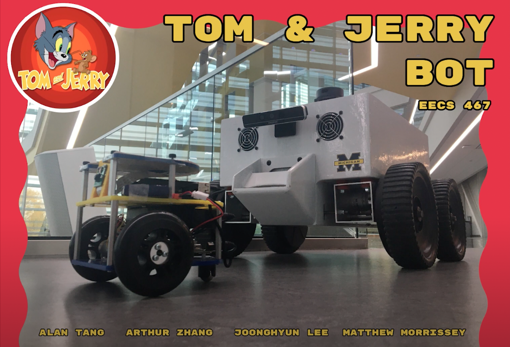
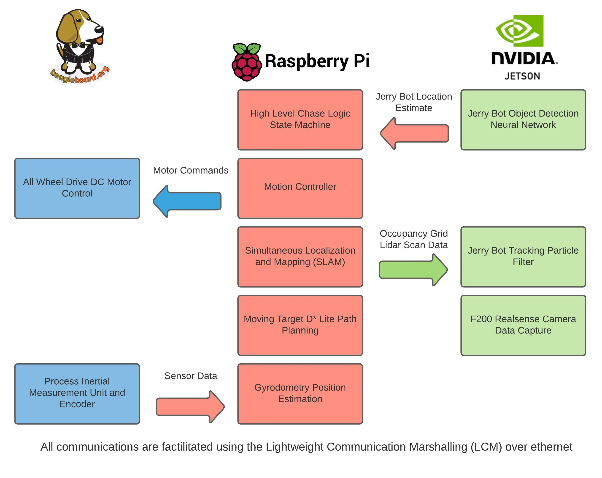
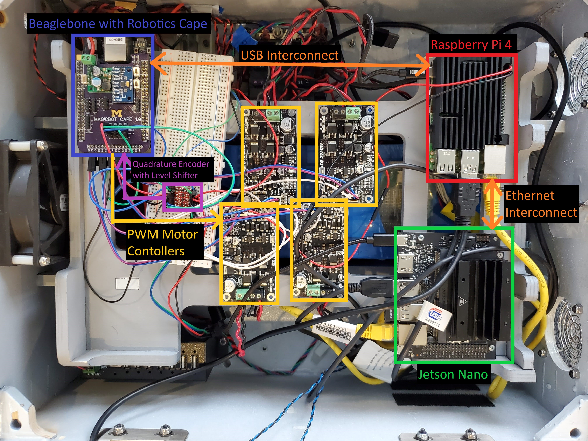
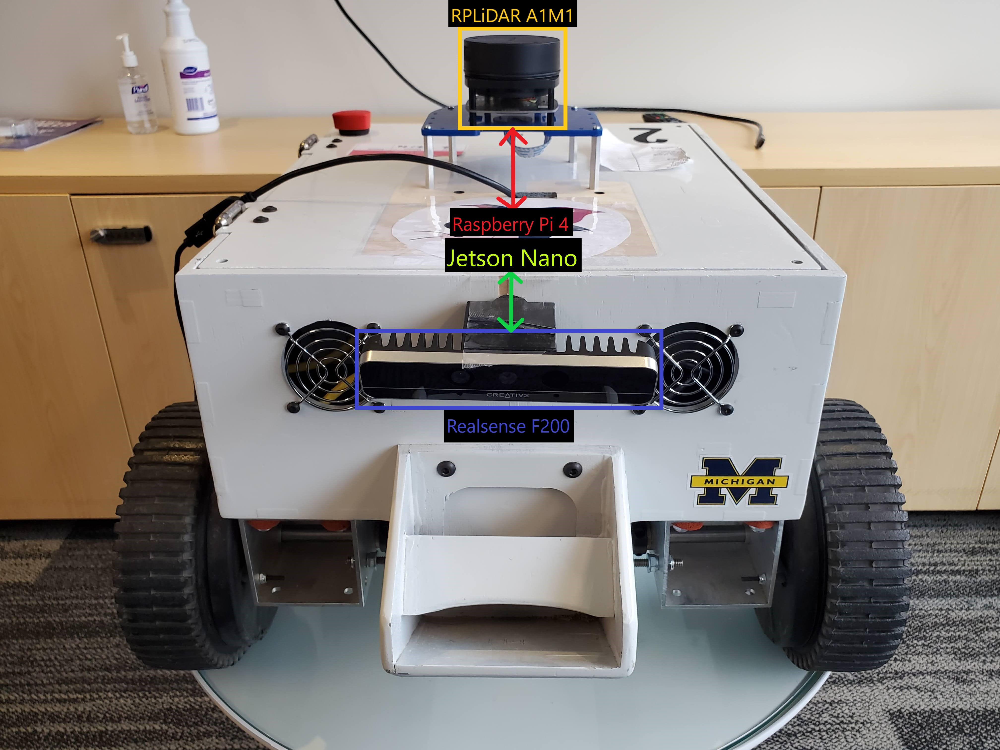
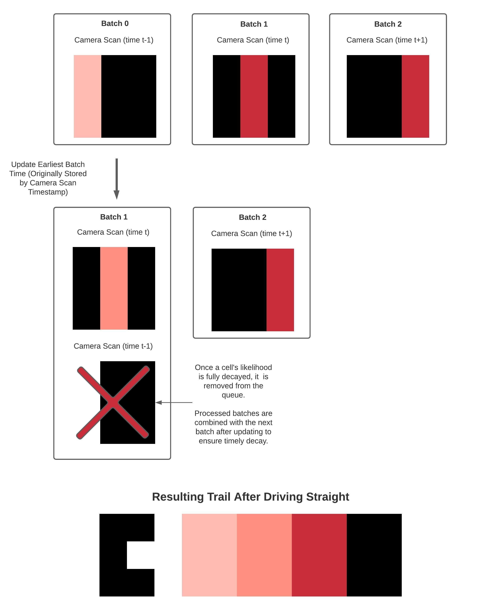

# Tom and Jerry Bot
Developed by Arthur Zhang, Joonghyun Lee, Matthew Morissey, Alan Tang

|:--:| 
| *Figure 1. TomBot (pictured on the right)* |

## Abstract

The Tom and Jerry Bot EECS 467 final design project consists of a tracker (Tom) bot with the goal of finding and following a target (Jerry) bot. This project uses dynamic path planning and SLAM obstacle avoidance to find the JerryBot, and computer vision to follow its movement. TomBot can track down the JerryBot using a particle filter to predict its current location, and continuously follow the JerryBot while in the field of view. This project has a wide range of applications, all in the form of an automated tracker bot which can find a dynamic target bot.

### Technical Summary

 - SLAM stack using particle filter that combines lidar scan matching and sensor fusion of encoders and onboard inertial measurement unit (IMU) to localize TomBot
 - Moving Target D* Lite for safe path planning, which is optimal for tracking moving targets in a dynamic environment
 - Real time computer vision on Jetson Nano to perform object segmentation and position estimation on JerryBot
 - Adaptive entropy particle filter for JerryBot localization using camera feedback
 - High level estimation strategy to determine next target location
 - LCM networking between onboard computers: Raspberry Pi 4, Nvidia Jetson, and Beaglebone Black 

## Project Architecture

|:--:| 
| *Figure 2. System Architecture* |

The TomBot is built on the Generation 1 Magic Bot platform, which was originally designed as a field robot by April Labs at the University of Michigan.

####Custom Components

- 1 April Labs MagicBot Gen 1 Chassis with Wheels
- Robotics Cape for BeagleBone Black
- Various Custom Wiring Harnesses
- Off-the-Shelf Parts
- 1 High Voltage Battery Pack (LiFePO4 720 Watt Hour 24V Nominal Voltage)
- 4 DC Brushed Motors (24V Rated torque: 9.5 kgf-cm Rated speed: 240 rpm)
- 4 Cytron MD10C Motor Controllers (5-30V range Up to 13 A continuously)
- 1 RPLidar A1M1
- Voltage Dividers (9V/12V/18V)
- Raspberry Pi 4
- Beaglebone Black
- Nvidia Jetson Nano
- Realsense F200 Camera
- Fuse Box
- Fan

There are 4 motors mounted on the magic chassis with the wheels attached. To complete the motor assembly, we created a custom wiring harness to connect the four motor controllers to the corresponding DC Motors. Then, we connected the motor controller inputs to the PWM output pins from the Beaglebone Black’s robotics cape. Unlike the Beaglebone Blue used in the MBot in Setpoint/Escape Challenge, the robotics cape with Beaglebone Black directly outputs PWM for motor controllers. The motor controller’s power terminals are connected to the power distribution terminals on the fuse box, which draw power directly from the 24V battery. In addition, the rear motors include Quadrature Phase Encoder wires, which are connected to the Robotics Cape encoder terminals via a level shifter. 

The remainder of the hardware used is similar to the hardware stack used on the MBot project. This includes the Raspberry Pi, LiDAR, and the low voltage Battery. The Realsense F200 Camera is used for object detection directly with the Nvidia Jetson Nano through a USB port. LiDAR directly connects to the RPi via USB. The Nvidia Jetson, Raspberry Pi, and Beaglebone communicate using LCM.

|:--:| 
| *Figure 3. Computing Hardware Layout* |

|:--:| 
| *Figure 4. Perception Hardware Layout* |

####Jerry Bot Implementation

For the implementation of the Jerry (tracker) bot, we reconfigured an MBot for the purposes listed in the “Demonstration” section. This Mbot allows for a live video feed and simple drive controls, both of which are already implemented in the teleop_simple file. We currently showcase the output video feed and transfer the keyboard controls for whoever is acting as the player to control the MBot remotely.

## Project Submodules

### Dynamic Path Planning Algorithm

The path planning algorithm should be able to handle exploring dynamic environments and appropriately detect and avoid collisions with obstacles introduced in the course. We are using a variation of  D* Lite for path planning. This variation, known as moving target D* Lite, is optimized for path planning towards a moving target. The algorithm runs on the Raspberry pi and utilizes information from the Realsense camera and inertial mass unit located on the Beaglebone. The path planning algorithm will operate in two separate modes: tracker mode and follower mode.

### Particle Filter Target Tracking

The TomBot uses a particle filter that processes output from the JerryBot object detection model to intelligently influence the particles. The following diagram models the actions of our target particles.

|:--:| 
| *Figure 5. Particle Filter Properties* |

#### Particle Properties

*Dynamic Particle Entropy*

The entropy or movement of particles gradually changes over time depending on whether or not the JerryBot is currently in view. This reduces the particle entropy to camera position estimation inaccuracy and increases it to the maximum speed of the JerryBot when the JerryBot has not been seen for a period of time

*Likelihood Grid Bias* 

Camera scans influence a likelihood grid that tracks the likelihood that the JerryBot is not in a specific cell. The immediate neighbors of each particle are summed up to form a gradient force that acts on the particle. In order to direct these particles towards lower likelihood regions, the program moves the particles in the opposite direction.

*Likelihood Grid Friction*

Each particle additionally moves a random amount, with the magnitude defined by its entropy value. To prevent particles from entering areas where the likelihood of the target robot is low, we apply a frictional force on the particles where the friction term is defined by the neighboring likelihood grid values. This reduces movement into areas of low likelihood.

*Camera Based Particle Weights*

If the JerryBot detection model does not identify a robot within the current camera frame, any particles that are currently in the camera field of view, excluding particles behind walls, are immediately assigned a low weight to prevent them from being resampled in the next iteration.

*Frontiers Bias*

To incentivize TomBot to explore the entire map if JerryBot has not been seen before, any particles that are sufficiently close to large frontiers are given a higher weight. This has the effect of biasing Tombot to explore the map fully while JerryBot is not in view and poses no significant effect to the particles when the JerryBot is in view because of the weight parameters assigned to frontiers.

Finally, the particle filter picks which particle to explore by using a three step process. First, the program selects the highest weighted particle. Second, it computes the average location of the particles within a 0.5 meter search radius around the highest weight particle. Finally, the filter selects the closest particle to the average particle location to return as JerryBot’s estimated location.

####Tracker Mode

The robot will engage tracker mode if the target robot is not within the Realsense camera’s line of sight. In tracker mode, TomBot hypothesizes the position of the target bot using a particle filter explained above, which predicts where the most likely location of the target bot will be. Moving Target D* Lite will allow us to efficiently plan the shortest paths to each of the particle estimates of the JerryBot position during the tracker state. While traversing the path, if any obstacles move in to obstruct the JerryBot, the path planning algorithm will react to objects that collide with its desired path. 

While searching for JerryBot, TomBot creates a queue of camera scan batches that work together that acts like a breadcrumb trail to represent where the robot has explored. During each iteration, the Jetson pushes cells in the current camera field of view that are not currently in the queue as a single “batch”. These batches are timestamped by the time during which each scan is taken. The batch with the earliest timestamp is popped from the queue and the target likelihoods for the cells in the batch are decreased to represent our lowering trust that JerryBot is not at cell locations seen early in time. For cells in the batch whose likelihood decrease the zero, these cells are removed from the batch to save memory. 

For cells in the top batch with a nonzero target likelihood, these cells are added to the next batch (if it exists) so that both of these batches can be updated in the next iteration. This update process creates a breadcrumb-like trail on the target likelihood grid.

|:--:| 
| *Figure 6. "Breadcrumb" Trail Sequence* |

### Follower Mode

Once JerryBot is within line of sight of the TomBot, it will switch search modes and primarily rely on the Realsense camera to locate and follow the target robot at a safe distance. TomBot performs real time computer vision on the Jetson to identify the target robot. After determining the location of JerryBot using an affine homography matrix, the Jetson reinitializes the tracking particles at this new location and resets the particle entropies. The particle filter uses visual odometry from the camera to update the particle location while JerryBot is in view. Finally, the Raspberry Pi receives the updated tracking particle location with the actual TomBot location and plans a path to it. These computers communicate using LCM (Light Communication Marshalling). Upon receiving this information, the Raspberry Pi recomputes the ideal follow path and avoids obstacles while doing so.

### Computer Vision

In TomBot’s follower mode, we need a method to accurately identify the JerryBot and localize it within the map. It is difficult to identify an object with just a depth sensor and LiDAR, so we need a robust method of identifying the JerryBot. Our team utilized MobileNetV2 architecture on Nvidia’s Transfer Learning Toolkit to train the object detection model. The MobileNetV2 model was selected primarily due to the memory and speed benefits that the architecture provides, as we are running the object detection on the Jetson Nano. After the object detection was performed, we used homography to transform the bounding box to a 2D location on the ground plane to localize the JerryBot.

### Dataset Collection and Training

Prior to having our camera working on Linux, we initially used a Windows camera app to capture camera data for our dataset. The aspect ratio and resolution were not the same as the Linux camera interface, but we decided to use it for the initial implementation of the Neural Net. While the Neural Network trained on this dataset worked on Linux, its accuracy was subpar. Therefore, we gathered data from Magic Bot’s operating environment from the Linux interface to further train the model. We gathered the datasets from various indoor environments to make the network robust, and we also gathered data from the operating environment for the demo and testing to improve accuracy during the bot’s operation.

### Findings and Discussion for Next Development Iteration

One of the biggest problems that we had with the MagicBot was tuning SLAM to work without major map deviations. Whilst we were able to adjust SLAM parameters to make SLAM usable, the instability of SLAM made derivative terms in our motion controller unusable. This may be mitigated in future implementations by using a more powerful processor to perform 3D SLAM with a longer-range 3D sensor than our current realsense camera. The MagicBot also is unable to turn-in-place, which further limits our ability to move away from obstacles that we did not initially perceive due to a shift in SLAM map.

We also faced significant hardware issues throughout testing and integration. Notably, the Beaglebone Black’s miniUSB Port used for power and UDP communication came detached from the PCB. We mitigated the issue by obtaining another Beaglebone Black to replace the damaged one. A similar issue occured with the Jetson Nano, when we were no longer receiving UDP packets over microUSB. Fortunately, we were able to communicate with the Jetson via Ethernet. We realized that miniUSB and microUSB are very fragile, and we will do a better job of protecting these ports in the future.

An ongoing problem is the Cytron Motor Controller failing under unknown conditions. We initially had 4 Cytron Motor Controllers that were already in the Magic Bot Chassis, as well as 4 additional Cytron Motor Controllers that we obtained brand new. Across the span of our project, four motor controllers, both new and old, failed due to unknown causes. It is notable that the motor controller connected to the rear right motor failed three times. While we selected the Cytron motor controllers for their low cost and implemented current protection to protect circuit components against damages, it seems that motor controllers with even greater protection features may be necessary for reliable operation on the TomBot.

### Future Directions

Throughout the course of the project, we obtained valuable skills in implementing SLAM on a medium-scale vehicle, and utilizing LiDAR and camera to localize a target. With the new knowledge gained from working on this project, lofty visions, like an autonomous truck convoy, may be possible. Instead of a controlled, 2D-like environment, we would operate in a dynamic 3D environment, and multiple trucks would be following each other.

Another potential direction for a future project is utilizing our particle filter tracking stack for search and rescue. We would replace the camera with a higher resolution camera, and use a more robust object detection model to enhance the tracking of a person in various environments. It would be able to accurately localize people while driving autonomously in unknown environments and transmit this information to human coordinators.
